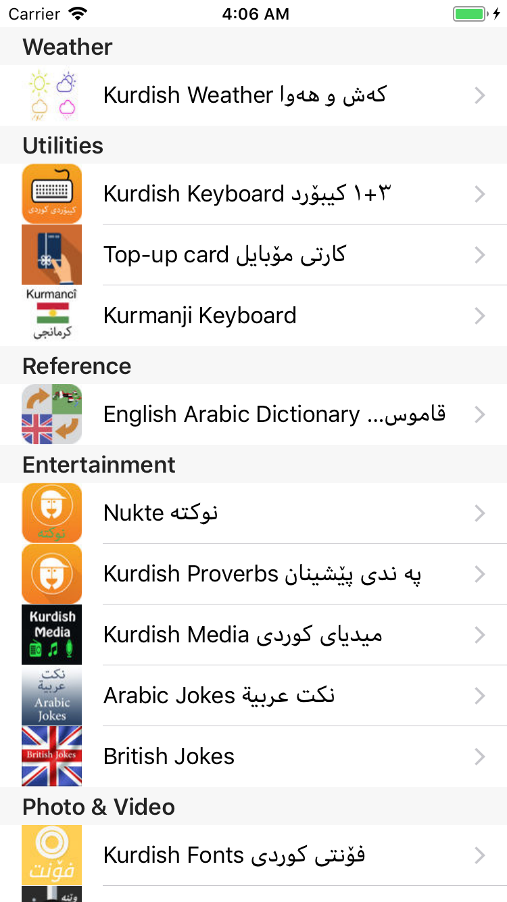

# DeveloperApps
This framework fetches the ios Applications of a particular developer from iTunes store.

    

	

## Demo
A grouped table view is used to show the categories in sections and the apps in the rows of the specific category.

## Usage
1. Copy the DeveloperApps and App Swift classes to your project.
2. Call `DeveloperApps.getApp(for: "SPECIFY the name of the developer here")` and get the list of the apps in the completion handler.
2. You can either use the approach used in the demo using UItableView or populate your data in a UICollectionView.

## Questions and Feedback

Feel free to [open an issue](https://github.com/dawand/DeveloperApps/issues/new), or find me [@dawanjiali on Twitter](https://twitter.com/dawanjiali).

## License

The MIT License (MIT)

Copyright (c) [2018] [Dawand Sulaiman]

Permission is hereby granted, free of charge, to any person obtaining a copy
of this software and associated documentation files (the "Software"), to deal
in the Software without restriction, including without limitation the rights
to use, copy, modify, merge, publish, distribute, sublicense, and/or sell
copies of the Software, and to permit persons to whom the Software is
furnished to do so, subject to the following conditions:

The above copyright notice and this permission notice shall be included in all
copies or substantial portions of the Software.

THE SOFTWARE IS PROVIDED "AS IS", WITHOUT WARRANTY OF ANY KIND, EXPRESS OR
IMPLIED, INCLUDING BUT NOT LIMITED TO THE WARRANTIES OF MERCHANTABILITY,
FITNESS FOR A PARTICULAR PURPOSE AND NONINFRINGEMENT. IN NO EVENT SHALL THE
AUTHORS OR COPYRIGHT HOLDERS BE LIABLE FOR ANY CLAIM, DAMAGES OR OTHER
LIABILITY, WHETHER IN AN ACTION OF CONTRACT, TORT OR OTHERWISE, ARISING FROM,
OUT OF OR IN CONNECTION WITH THE SOFTWARE OR THE USE OR OTHER DEALINGS IN THE
SOFTWARE.
